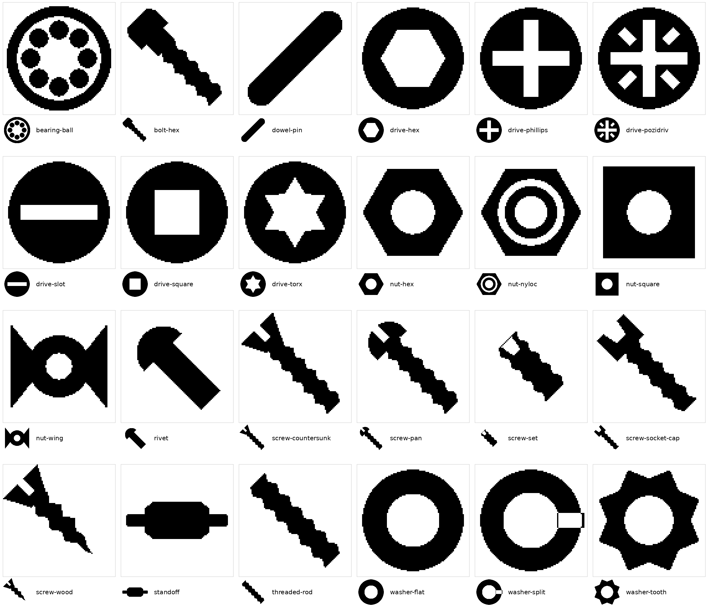
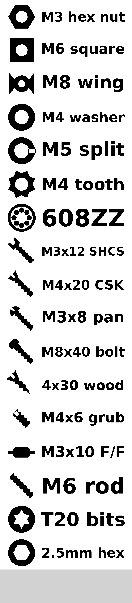

# ptuich

A terminal UI for the Brother PT-P910BT label printer.

**Status: early.** Nothing here is usable yet — so far the repo contains the
icon set and the tooling that generates it.

## Why

The printer is good. P-touch Editor is not. The goal is a small tool that does
the one thing this printer gets used for: keep a list of short labels, edit
them, and print any subset onto a fixed-size template — 29 × 9 mm, centred
text, with an optional icon.

## Planned shape

- `render(spec) -> PIL.Image` — pure, no printer, no UI
- labels stored in a YAML file, editable in `$EDITOR` as well as in the TUI
- Textual front end: list, multi-select, print
- printing via [`ptouch`](https://pypi.org/project/ptouch/), which supports the
  P910BT over USB

Icons are referenced as tokens inside the label text (`{nut-hex} M3 nut`), so
the TUI never has to render an SVG. Names are resolved local-first, then
against the Iconify API.

## Icons

`src/ptuich/icons/` holds 24 fastener icons drawn specifically for 9 mm tape:

| group | icons |
| --- | --- |
| nuts | `nut-hex` `nut-square` `nut-nyloc` `nut-wing` |
| washers | `washer-flat` `washer-split` `washer-tooth` |
| screws & bolts | `screw-pan` `screw-countersunk` `screw-socket-cap` `bolt-hex` `screw-wood` `screw-set` `threaded-rod` |
| drive types | `drive-slot` `drive-phillips` `drive-pozidriv` `drive-hex` `drive-torx` `drive-square` |
| other | `bearing-ball` `dowel-pin` `standoff` `rivet` |

`index.json` maps each name to search keywords.



### Design constraints

9 mm tape gives about 6.8 mm of printable height — roughly 90 px at 360 dpi —
and the output is 1-bit after a hard threshold. That rules out most general
icon sets: fine linework and small detail simply disappear. These are drawn as
solid silhouettes with holes cut using `fill-rule="evenodd"`, and nothing is
thinner than `MIN_FEATURE` (26 units of a 512 viewBox, ≈ 4.5 px at print size).

Screws are drawn vertically and rotated 45°, which lets a long thin shape fill
a square box, then scaled 1.12× so their visual weight matches the head-on
icons.

Head-on drive recesses (`drive-*`) hold up far better at this size than side
profiles do. If you are labelling bit sets or sorting by drive rather than by
fastener type, prefer those.



### Regenerating

The tools in `tools/` are standalone and are not part of the package; they need
`cairosvg` and `pillow`:

```sh
uv run --with cairosvg --with pillow python tools/gen_icons.py      # write the SVGs
uv run --with cairosvg --with pillow python tools/contact_sheet.py  # 1x + 4x, thresholded
uv run --with cairosvg --with pillow python tools/render_label.py   # sample 29x9mm labels
```

Always check a change on the contact sheet before committing it. Problems here
are invisible at 512 px and obvious at 90 px — overlapping subpaths in one
`<path>` punch holes instead of merging, and arcs happily run off-canvas.

`MIN_FEATURE` in `tools/gen_icons.py` is the knob to turn if the icon slot ends
up smaller than 90 px.

### Adding icons

Add an `add(name, body, rotate=..., tags=...)` call in `tools/gen_icons.py` and
re-run it. Additive shapes that overlap each other must go in separate `path()`
calls; `evenodd` only unions within a single path.

For anything that is not a fastener, don't add it here — reference it as an
Iconify token (`{mdi:screw-lag}`) and let the resolver cache it.

### Licensing

These are original geometry, not traced or derived from any existing icon set,
so they carry the repo's MIT license and no attribution burden. Icons fetched
from Iconify at runtime keep their own upstream licenses.
